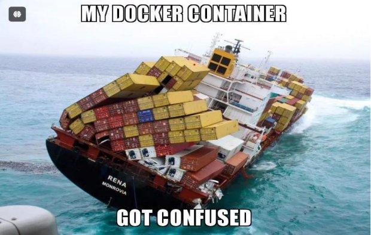
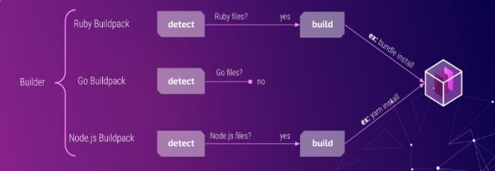

Simplifying Containerization with SecurePacks

Ever found yourself in the labyrinth of **containerizing applications with Docker?**

If you have, you're not alone. While Docker revolutionized the way we deploy and manage applications, it introduced its own set of complexities, especially for developers striving for simplicity and efficiency.

**Picture this:** You've spent countless hours meticulously crafting your application code, ensuring it runs seamlessly on your local machine. But when it comes to packaging it into a Docker container for deployment, things start to unravel. Dependency mismatches, conflicting configurations, and compatibility issues rear their heads, turning what should be a straightforward process into a developer's nightmare.🥹

***Enter SecurePacks – the unsung heroes of containerization, here to rescue developers from the clutches of Docker woes.***

So, what exactly are SecurePacks?

Think of them as intelligent assistants that **analyze** your application, **detect** its requirements, and automatically **assemble** everything needed to run it smoothly in a container. No more manual tinkering with Dockerfiles or battling dependency dragons – SecurePacks streamline the entire process, allowing you to focus on what you do best: writing code.

But how do SecurePacks work their magic? Let's delve into the technical wizardry behind these ingenious tools.

How SecurePacks Work?

At their core, SecurePacks rely on a simple yet powerful concept: **layers**. Instead of bundling everything into a monolithic container image, SecurePacks break down your application and its dependencies into discrete layers. Each layer encapsulates a specific aspect of your application, such as runtime libraries, frameworks, or even custom configurations.

This layer-based approach offers several key advantages. First and foremost, it promotes modularity and reusability, allowing SecurePacks to efficiently cache and share common dependencies across multiple applications. As a result, subsequent builds become faster and more resource-efficient, sparing developers from redundant work and speeding up deployment pipelines.

Furthermore, SecurePacks leverage sophisticated detection mechanisms to tailor each layer to the unique requirements of your application. Whether you're working with a Python web app, a Node.js API, or a Java microservice, SecurePacks adapt seamlessly, identifying the necessary dependencies and configurations with uncanny precision.

But perhaps the most compelling aspect of SecurePacks is their simplicity. Unlike Docker, which demands a deep understanding of container internals and a mastery of arcane incantations, SecurePacks offer a refreshingly intuitive experience. With just a few commands, developers can transform their applications into lightweight, portable containers, ready to conquer the cloud.

Imagine the joy of seamlessly transitioning from development to production, confident that your containerized application will behave exactly as expected, thanks to the reliability and consistency afforded by SecurePacks. No more last-minute troubleshooting or frantic debugging sessions – just smooth sailing from code to deployment.

In conclusion, SecurePacks represent a paradigm shift in the world of containerization, offering a beacon of hope to developers drowning in Docker despair. By abstracting away complexity, automating tedious tasks, and promoting best practices, SecurePacks empower developers to focus on innovation and creativity, rather than getting bogged down by infrastructure intricacies.

So the next time you embark on the journey of containerizing your application, remember the power of SecurePacks – your trusted allies in the quest for simplicity, efficiency, and peace of mind.

Happy coding!
